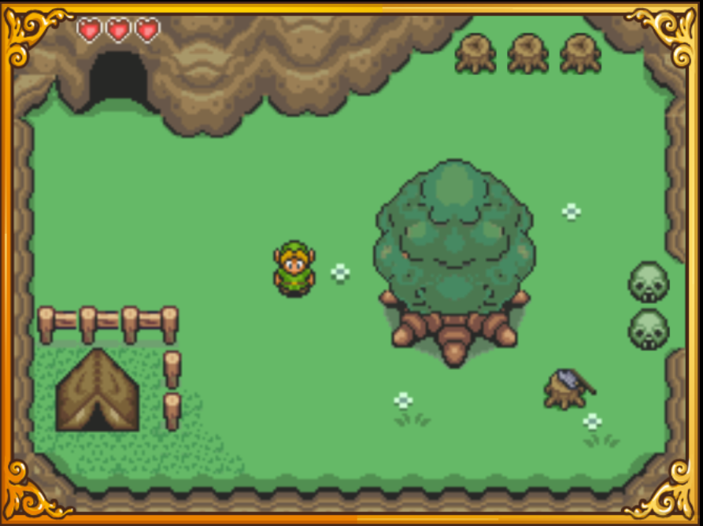
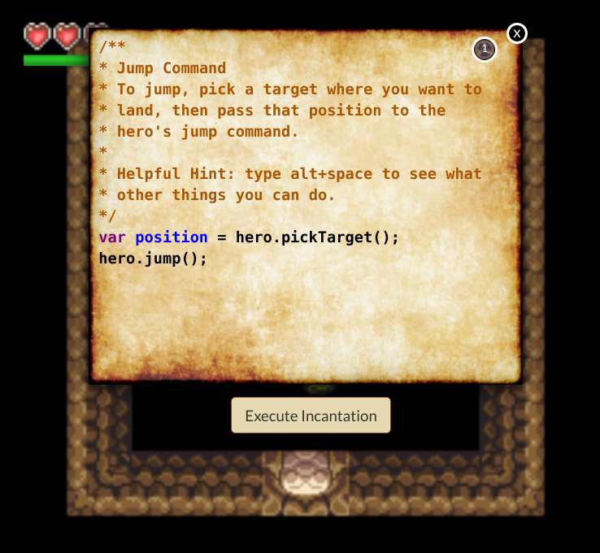

# Codewarrior Web Game

A Zelda-clone web game whose intent is to teach programming. Mostly though, it's a hobby project for me to futz around with 2D web games.

## Dependencies

- NodeJS v8+
- Yarn v1.16+

## How to Run

### Development

 `$> yarn start` Run webpack dev server, opening browser to localhost on port 3000

 `$> yarn test` Start up `jest` and run unit tests in watch mode

### Production

#### Environment Variables
Build and deployment require some environment variables to be set. These can all be set in a file in the root of the project named: `.env.local` 

| Variable Name | Purpose | Example |
| ------------- | ------- | ------- |
| PUBLIC_URL | Directory where public assets get served from. It's prepended to asset references, like: `` | /sites/all/modules/custom/codewarrior/ |
| REACT_APP_BASE_URL | The absolute URL where the application lives, including "root" slash | http://jaygordo.com/ |
| REACT_APP_BUILD_DESTINATION | Local directory where the built application will be copied after build completes      | /home/jgordon/projects/jaygordo.com/drupal/sites/all/modules/custom/codewarrior |
| REACT_APP_THEME_DESTINATION | Drupal theme main page that index.html will become after build completes  | /home/jgordon/projects/jaygordo.com/drupal/sites/all/modules/custom/codewarrior/page-codewarrior.tpl.php |
| REACT_APP_SERVER_PATH | Destination on server where files will be deployed | /var/www/jaygordo.com/sites/all/modules/custom/codewarrior/ |
| REACT_APP_REMOTE_HOST | Hostname to use during deploy when uploading files to server via `scp` | jaygordo.com |
| REACT_APP_DEPLOY_USER | The user to use during deploy when connecting to server | www-data |

#### Commands
| Command | Purpose |
| ------- | ------- |
| `$> yarn build` | Runs webpack to build the app in production mode |
| `$> yarn deploy` | Runs deployment script to build the app, then upload the dist files to remote server |

#### Deployment
The deployment script is in `scripts/deploy.sh`. It does the following:
- Push latest changes to git
- Build the app
- Copy files to server
  - Zip + tar up the built app
  - Use SCP to copy files to remote server
  - Copy the built index.html file to Drupal theme directory
- Clean everything up
- Clear webserver cache

## Demonstrates the following concepts:

**Game Engine**

- Data driven character and level creation, enemy path creation etc
- All aspects of building levels are done with external tools, specifically [Tiled Map Editor](https://www.mapeditor.org/) and [TexturePacker](https://www.codeandweb.com/texturepacker)
- Game design patterns and abstractions like Game Loop, State Machine, Renderer (abstraction for rendering so underlying tech can be swappable, Canvas vs WebGL), Render Tree, Entity, Pathfinder etc.
- Canvas renderer (no WebGL yet)

**Path Finding**:

- A\* pathfinding algorithm
- Tile based map
- Surface type affects movement (water etc)

**In Game Programming Environment**

- Character behaviors are created by writing small JavaScript programs in the game

- Sandboxed JavaScript environment using [acorn.js](https://github.com/acornjs/acorn)
- Secure interface from sandboxed JavaScript environment to game entities

